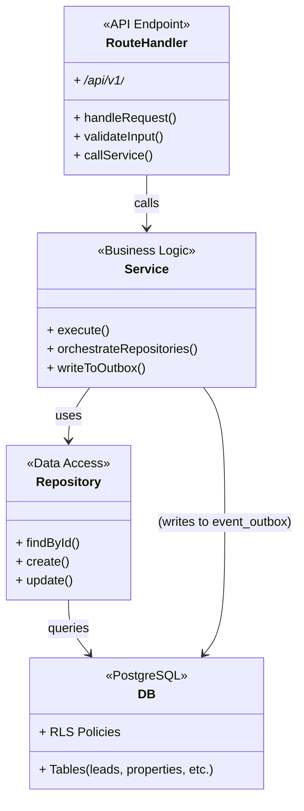
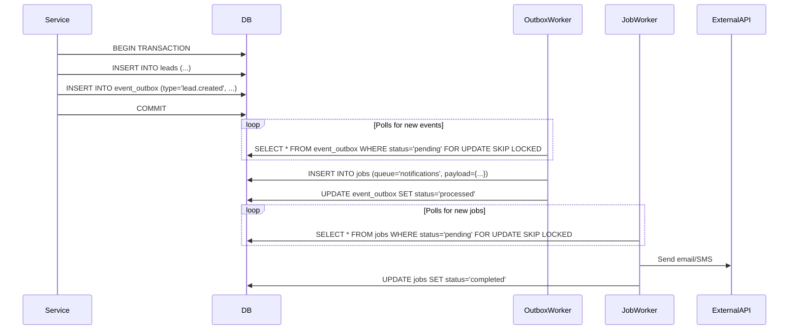
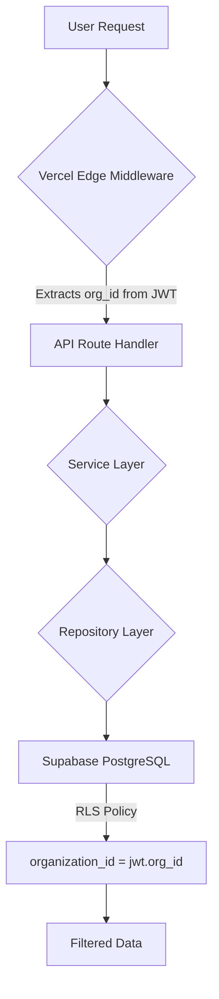
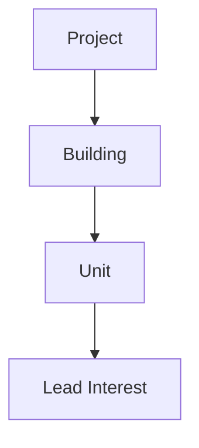

# Architecture Overview

> This document describes the high-level and component-level architecture for the **Estate Flow CRM** SaaS platform. The architecture is designed for a production-grade, multi-tenant environment, prioritizing security, scalability, and maintainability.

## 1. System Architecture Diagram
```mermaid
flowchart TB
    subgraph Client[Client]
        UI[Next.js 15 App Router\n(React Server Components)\nTailwind + shadcn/ui]
    end

    subgraph Vercel[Vercel Platform]
        Edge[Edge Middleware\n(Auth, Tenant Context)]
        Server[Serverless Functions\n(API Routes, Server Actions)]
    end

    subgraph Supabase[Supabase Platform]
        DB[(PostgreSQL\n+ RLS)]
        Auth[Auth Service]
        Storage[File Storage]
        Realtime[Realtime Service]
    end

    subgraph BackgroundProcessing[Background Processing]
        OutboxWorker[Outbox Worker]
        JobWorker[Job Worker]
    end

    subgraph Integrations[Third-Party Services]
        Stripe[Stripe/Razorpay]
        Twilio[Twilio Voice/WhatsApp]
        Resend[Resend Email]
    end

    UI -->|HTTP Requests| Edge
    Edge -->|Forwards| Server
    Server -->|SQL Queries| DB
    Server -->|Auth Checks| Auth
    Server -->|File Ops| Storage
    Server -->|Calls| Integrations

    DB -- "Writes to `event_outbox`" --> OutboxWorker
    OutboxWorker -- "Creates jobs in `jobs` table" --> JobWorker
    JobWorker -- "Executes tasks" --> Integrations
    JobWorker -- "Updates" --> DB

    DB -- "Database Changes" --> Realtime
    Realtime -- "Pushes Updates" --> UI
```

### Key Principles
- **Multi-Tenant First:** All data is partitioned by `organization_id`, enforced by Supabase Row-Level Security (RLS).
- **Simplified Stack:** The architecture relies only on Vercel and Supabase, minimizing external dependencies.
- **Server-Centric:** Business logic resides in a Service Layer on the backend, not in the client.
- **Asynchronous by Default:** An Event Outbox and a PostgreSQL-based job queue handle all non-critical side effects.
- **Versioned APIs:** All API endpoints are versioned (e.g., `/api/v1/*`) for stable evolution.

---
## 2. Backend Architecture

- **Route Handlers:** Thin layers responsible for HTTP request/response, input validation (using Zod), and authentication checks.
- **Service Layer:** Contains all business logic. It orchestrates operations across multiple repositories and ensures transactional integrity. It is the only layer that writes to the `event_outbox`.
- **Repository Layer:** Abstracts all database interactions. Each repository is responsible for a single table or a closely related group of tables. It never contains business logic.

---
## 3. Event-Driven & Background Job Architecture
The system avoids fragile, in-memory event buses and external dependencies like Redis.

- **Event Outbox Pattern:** Guarantees that an event is created if and only if the business transaction succeeds. This provides "at-least-once" delivery semantics for side effects.
- **PostgreSQL as a Queue:** The `jobs` table acts as a reliable, transactional job queue. Workers use `SELECT ... FOR UPDATE SKIP LOCKED` to safely pull jobs without contention. This eliminates the need for BullMQ/Redis.

---
## 4. Multi-Tenant Architecture
Tenant isolation is the cornerstone of the architecture, enforced at multiple levels.

- **Authentication:** Supabase Auth issues JWTs that are enriched with the user's `organization_id` and `role`.
- **RLS Policies:** Every database query is automatically filtered by the `organization_id` in the JWT. It is impossible for a query to access another tenant's data.
- **Scoped Resources:** All tenant-specific configurations, like feature flags (`feature_flags` table) and integration settings (`integration_settings` table), are stored in tables with an `organization_id` and protected by RLS.

---
## Organization Configuration Layer
Purpose: Store tenant operational settings.

Examples:
- Timezone
- Business Hours
- Branding
- SLA Rules

Relationship:
```
Organization
    → Organization Settings
```

Implementation note: Settings are stored in the `organization_settings` table and retrieved/updated via `/api/v1/settings` (Owner/Admin).

---
## 5. Billing & Feature Flag Architecture
- **Billing:** A set of `plans`, `subscriptions`, and `usage_metrics` tables provides the foundation for a future-proof billing system. Usage metrics (e.g., number of users, leads created) are tracked per tenant. This structure is designed to integrate with payment providers like Stripe or Razorpay.
- **Feature Flags:** The `feature_flags` table allows features to be toggled on or off for specific tenants. This enables controlled rollouts, beta programs, and tiered pricing plans. An admin API (`/api/v1/feature-flags`) allows for runtime management of these flags.

---
## 6. Deployment & Operations
The entire platform is designed to be deployed and operated with only two main providers:
- **Vercel:** For hosting the Next.js frontend, API routes, and serverless functions.
- **Supabase:** For the PostgreSQL database, authentication, file storage, and realtime capabilities.

This lean stack reduces operational complexity and cost, making it ideal for a scalable SaaS product.

---
## 7. Real Estate Domain Architecture
The CRM is optimized for the core real-estate workflow: capturing interest, managing engagement, scheduling site visits, progressing negotiation, and closing.

### Lead Lifecycle
```mermaid
stateDiagram-v2
    [*] --> New
    New --> Contacted
    Contacted --> Interested
    Interested --> "Site Visit Scheduled"
    "Site Visit Scheduled" --> "Site Visit Completed"
    "Site Visit Completed" --> Negotiation
    Negotiation --> "Booking Done"
    "Booking Done" --> Won

    New --> Lost
    Contacted --> Lost
    Interested --> Lost
    "Site Visit Scheduled" --> Lost
    "Site Visit Completed" --> Lost
    Negotiation --> Lost
    "Booking Done" --> Lost

    New --> "Not Responding"
    Contacted --> "Not Responding"
    Interested --> "Not Responding"
    "Site Visit Scheduled" --> "Not Responding"
```

**Domain notes**:
- Site visit completion/no-show is tracked on `site_visits` and can advance (or stall) the lead lifecycle.
- SLA measurement is derived from lead creation and first meaningful engagement and stored in `lead_sla_metrics`.
- Duplicate detection/merge is part of the lead domain and gates certain actions while under review.

---
## 8. Inventory Architecture
Real-estate inventory is hierarchical and must be modeled explicitly for reporting, availability tracking, and lead interest mapping.

### Inventory Hierarchy


**Relationship model**:
- `projects` is the top-level entity (developer, location, status).
- `buildings` belongs to `projects`.
- `units` belongs to `buildings` and represents sellable/rentable inventory with `availability`.
- `properties` provides a canonical, uniform representation (`type`, `reference_id`) for search and UI rendering across project/building/unit.
- Lead interest is tracked by linking `leads` to `properties` (e.g., via `lead_property_shares` and future “lead_interests” if deeper modeling is needed).
